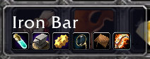
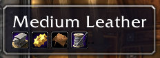

# ItemTooltipIcons

A World of Warcraft addon for Vanilla WoW (1.12.1) and Turtle WoW that enhances item tooltips by displaying profession icons for crafting ingredients.

*Inspired by [ItemTooltipProfessionIcons](https://www.curseforge.com/wow/addons/itemtooltipprofessionicons)*

## Features

- **Visual Enhancement**: Adds small profession icons to item tooltips when the item is used as a crafting reagent
- **Multi-Profession Support**: Shows icons for all professions that can use the item
- **Vanilla & Turtle WoW Compatible**: Works with both Vanilla WoW (1.12.1) and Turtle WoW (includes Jewelcrafting support)

## How It Works

When you hover over an item that can be used in crafting recipes, small profession icons will appear in the tooltip. The icons represent which professions can use that item as a reagent.

## Screenshots

